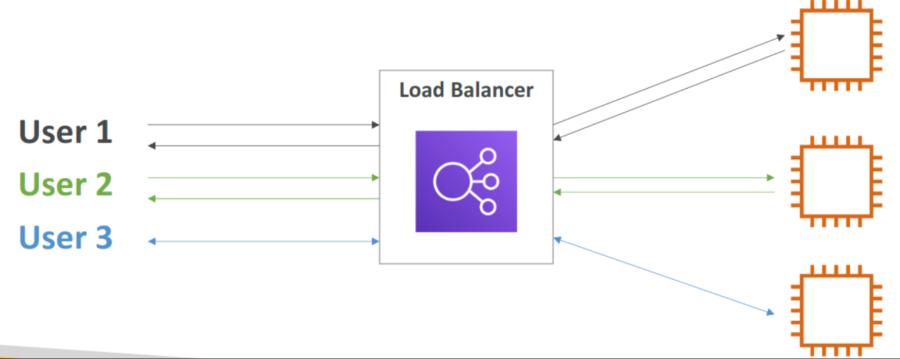

# Elastic Load Balancing (ELB) & Auto Scaling Groups (ASG)

    
Describe scalability ?

    Scalability means an application/system that can handle greater loads by making the hardware stronger (scale up), or by adding nodes (scale out). There are two types of scalability?
    1. Vertical scalability (scale up/down)
        1. This means increasing the size of instance (For EC2: t2.micro → t2.large)
        2. This is very common for non distributed systems, such as relational database.
        3. There's usually a hardware limit to how much you can vertically scale

    2. Horizontal scalability (scale in/out)
        1. This means increasing the number of instances / systems for your application (For EC2: Auto scaling group & Load balancer)
        2. Horizontal scaling implies distributed system.
        3. This is very common for web application/ modern application
        4. Because of Amazon EC2 offering it is easy to horizontally scale the system

    
 what do you mean by high availability ? 

    - It means running your application/system in more than two availability zones (For EC2: Auto scaling group multi AZ & load balancer multi AZ)
    - The goal of high availability is to survive data center loss

    
What is the difference between scalability, elasticity and agility ?

    
    - Scalability: Ability to accommodate a large load by making the hardware stronger (scale up) or by adding nodes (scaling out)
    - Elasticity: Once the system is scalable, elasticity means that there will be some "auto-scaling" so that the system can scale based on the load: This is follows pay-per-use, match demand, and optimize costs approach.
    - Agility: It is nether related to scalability nor elasticity. This means cloud technology enables adding of new IT resources a click away.

    
Describe load balancing ?

    Load balancing is the process to forward internet traffic from load balancers (server) to multiple servers (EC2 Instances) downstream. 

    - Why to use a load balancer ?
        - Spread load across multiple downstream instance.
        - Expose a single point of access (DNS) to your application.
        - Seamlessly handle failures of downstream instances.
        - Do regular health checks to your instances.
        - Easily provide SSL terminations (HTTPS) for your websites.
        - High availability across zones
    - Why to use an Elastic load balancer (ELB) ?
        - An ELB is a managed load balancer
            - AWS guarantees that it will be working
            - AWS takes care of  upgrades, maintenance, high availability
            - AWS provides only a few configuration knobs.
        - It costs less to setup your own load balancer but it will be a lot more effort on the user side.
        - There are 2 major kinds of load balancer
            - Application load balancer (HTTP/HTTPS only) - Layer 7
            - Network load balancer (ultra-high performance, allows for TCP) - Layer 4

    
What do you mean by auto scaling groups (ASG) ?

    - Auto scaling groups is the service provided by the aws to automatically scaling out/in to match the increased and decreased load. Because, In real-life, the load on a website and application can change.
    - The main goals of an ASG is to only run at an optimal capacity (Cost Savings).
    - The tasks performed by ASG are:
        - Scale out (add EC2 instances) to match an increased load
        - Scale in (remove EC2 instances) to match a decreased load
        - Ensure we have a minimum and a maximum number of machines running
        - Automatically register new instances to a load balancer
        - Replace unhealthy instance

    
What are the ASG scaling strategies ?

    
    There are three categories of scaling
    1. Manual scaling: Update the size of an ASG manually
    2. Dynamic scaling: Respond to changing demand
        1. Simple / step scaling
            1. When a cloud alarm is triggered (example CPU > 70%), then add 2 units
            2. When a CloudWatch alarm is triggered (example CPU < 30%), then remove 1
        2. Target Tracking Scaling
            1. Example: I want the average ASG CPU to stay at around 40%
        3. Scheduled Scaling
            1. Anticipate a scaling based on known usage patterns
            2. Example: increase the min. capacity to 10 at 5 pm on Fridays
    3. Predictive Scaling
        1. Uses Machine Learning to predict future traffic ahead of time
        2. Automatically provisions the right number of EC2 instances in advance

    
Hands on

    - Create a Application load balancer
        - [ ]  Create two EC2 server with user data as start script
        - [ ]  Use these instance to create application load balancer

    - Create auto scaling groups
        - [ ]  Create a lunch template for auto scaling group
        - [ ]  Create a highly available ASG with two desired instance
        - [ ]  Terminate one of the created EC2 instance

### [Link to the notion for better readability](https://bejewled-kip-9a9.notion.site/Elastic-Load-Balancing-ELB-Auto-Scaling-Groups-ASG-545276e8cc764c9e9cc9d5a2815afb2b)